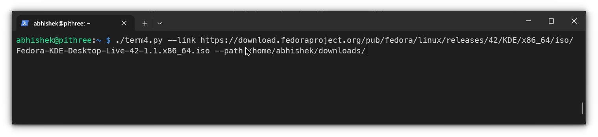

# term Download Manager (tDM)

A feature-rich, terminal-based download manager with a beautiful colored TUI, multi-threaded downloads, and resume capability.


## Features

- 🎨 **Beautiful Colored TUI** - Real-time progress with colored interface
- 🚀 **Multi-threaded Downloads** - Utilizes multiple CPU cores for faster downloads
- ⏯️ **Resume Capability** - Continue interrupted downloads from where they left off
- 🗂️ **Organized Temp Files** - Uses hidden temporary folders to keep your download directory clean
- 🛡️ **Graceful Shutdown** - Properly handles interruptions and maintains download state
- 📊 **Real-time Statistics** - Download speed, time remaining, and progress percentage
- 🔄 **Smart Retry Logic** - Automatic retries with configurable attempts and delays

##  Here are some screenshots for reference:

#### Starting a Download


#### Real-time Status Window


#### Resume Download Prompt


#### Download Interrupted


#### Download Complete


#### Merging Downloaded Chunks


## Installation

### Prerequisites

- Python 3.6 or higher
- `curses` library (usually included with Python on Unix systems)

### Quick Start

```bash
# Clone or download the script
chmod +x tDM.py

# Make it executable and run
./tDM.py --link "YOUR_URL" --path "/download/directory"
```

## Usage

### Basic Download

```bash
./tDM.py --link "https://example.com/large-file.iso" --path "~/downloads"
```

### Advanced Options

```bash
# With resume behavior control
./tDM.py --link "URL" --path "~/downloads" --resume ask
./tDM.py --link "URL" --path "~/downloads" --resume yes
./tDM.py --link "URL" --path "~/downloads" --resume no
```

### Command Line Arguments

| Argument   | Description                                    | Default           |
| ---------- | ---------------------------------------------- | ----------------- |
| `--link`   | **Required** URL to download from (HTTP/HTTPS) | -                 |
| `--path`   | Directory to save the downloaded file          | Current directory |
| `--resume` | Resume behavior: `ask`, `yes`, or `no`         | `ask`             |

## How It Works

### File Organization

```
downloads/
├── large-file.iso                    # Final downloaded file
└── .large-file.iso.temp/            # Hidden temp directory
    ├── chunk_0                      # Download chunk 1
    ├── chunk_1                      # Download chunk 2
    └── chunk_2                      # Download chunk 3
```

### Resume Feature

When you restart a download:

- The script detects existing temporary files
- Shows resume size and asks for confirmation (if `--resume ask`)
- Continues downloading from the last byte
- Automatically merges chunks when complete

### Multi-threading

- Automatically detects CPU cores for optimal thread count
- Divides large files into chunks for parallel downloading
- Falls back to single-thread if server doesn't support ranges

## TUI Interface

The terminal interface displays:

- 📁 File name and total size
- 📊 Progress bar with percentage
- ⚡ Download speed in KB/s
- ⏱️ Estimated time remaining
- 🧵 Number of active threads
- ❌ Error count (if any)
- 🔄 Resume status

## Control Commands

- **Ctrl+C**: Graceful shutdown during download
- **Ctrl+C**: Immediate exit during resume prompt
- **Any key**: Exit after completion or interruption

## Examples

### Download a Linux ISO

```bash
./tDM.py \
  --link "https://download.fedoraproject.org/pub/fedora/linux/releases/42/Workstation/x86_64/iso/Fedora-Workstation-Live-42-1.1.x86_64.iso" \
  --path "~/downloads"
```

### Resume Interrupted Download

```bash
# If download was interrupted, run same command again
./tDM.py --link "URL" --path "~/downloads"
# It will detect temp files and ask to resume
```

### Force Fresh Download

```bash
./tDM.py --link "URL" --path "~/downloads" --resume no
```

## Error Handling

- **Network Issues**: Automatic retry with exponential backoff
- **Server Errors**: Clear error messages with retry count
- **Disk Space**: Proper cleanup on insufficient space
- **Interruptions**: Graceful shutdown preserving download state

## Configuration

### Environment Variables

You can set default values by exporting environment variables:

```bash
export DEFAULT_DOWNLOAD_PATH="$HOME/downloads"
```

### Retry Settings

Modify these constants in the script:

```python
MAX_RETRIES = 5        # Maximum retry attempts
RETRY_DELAY = 5        # Delay between retries in seconds
```

## Troubleshooting

### Common Issues

1. **"curses" module not found**
   
   - On Windows: Use WSL or a different terminal
   - On macOS/Linux: Should be included by default

2. **Permission denied**
   
   ```bash
   chmod +x tDM.py
   ```

3. **Download stuck at 0%**
   
   - Check internet connection
   - Verify URL is accessible
   - Server might not support range requests

4. **Temp files not cleaning up**
   
   - Manual cleanup: `rm -rf .*.temp/`
   - The script cleans up automatically on successful completion

### Debug Mode

For detailed logging, you can modify the script to add print statements or use:

```bash
python3 -v tDM.py --link "URL" 2>&1 | tee download.log
```

## License

MIT License - feel free to use this project for personal or commercial purposes.

## Contributing

Contributions are welcome! Please feel free to submit pull requests or open issues for:

- Bug reports
- Feature requests
- Performance improvements
- Documentation updates